# How to use Vino

*Know when to pour.*

Vino is a vineyard water-intelligence app: it looks at every block in the farm and tells you three things, every day: how thirsty the vines actually are, whether that's good or bad for the wine, and exactly what to do about it. This guide walks through the app screen by screen, in the order you'd naturally use them, with real screenshots from the app running on its own demo data (`as_of` 20 January 2026, a mid-season Stellenbosch farm).

The one idea to hold onto: for wine grapes, a little thirst is *good*. Vino doesn't just flag blocks that are too dry, it flags blocks that are **too wet** too, because over-watering dilutes flavour just as surely as drought stunts it. Everything else in this guide follows from that.

A polished, interactive version of this guide (same content, nicer to browse) is also available as a shareable page; ask in-session for the link if you don't have it.

---

## Contents

1. [Dashboard](#1-dashboard-your-whole-farm-at-a-glance)
2. [Block detail](#2-block-detail-why-this-block-and-whats-driving-it)
3. [AI Insights](#3-ai-insights-click-anything-get-a-plain-english-answer)
4. [Pour & Hold Slips](#4-pour--hold-slips-todays-watering-order-on-paper)
5. [Battle Plan](#5-battle-plan-when-you-dont-have-enough-water-for-everyone)
6. [Season Water Bank](#6-season-water-bank-will-the-dam-last-until-harvest)
7. [Scenario](#7-scenario-what-happens-if-the-weather-turns)
8. [Field Mode](#8-field-mode-the-screen-you-actually-open-every-morning)
9. [Validate](#9-validate-proving-the-model-is-actually-right)
10. [Settings](#10-settings-choosing-where-the-climate-data-comes-from)
11. [Reading the colors and the numbers](#11-reading-the-colors-and-the-numbers)
12. [Running it yourself](#12-running-it-yourself)

---

## 1. Dashboard: your whole farm, at a glance

This is what you see first. A satellite map with every block traced to its real outline, colour-coded by how urgently it needs attention, plus a ranked list beside it so you don't even need to read the map to know where to start.

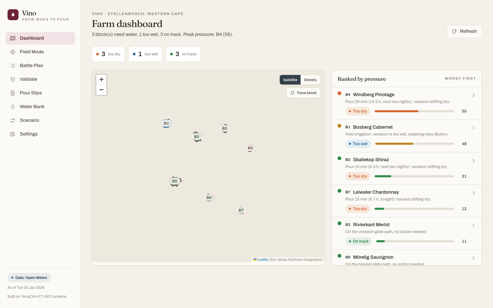
*The Dashboard on its own demo farm: seven traced blocks, three too dry, one too wet (B1, hatched blue), three on track. Peak pressure: B4 at 55.*

**How to read it:** Each polygon on the map is a real vineyard block, hand-traced to its actual field edges, not a placeholder rectangle. The colour is the block's **status**: green means on track, amber and orange mean it's getting dry, red means critical, and a block with a **blue diagonal hatch** means the opposite problem: it's too wet and needs to be left alone. The list on the right ranks every block by how much attention it needs right now, worst first. Click any block, on the map or in the list, to open its detail panel.

The badge near the top of the screen (e.g. `Data: Open-Meteo`) tells you which climate data source is currently powering every number on the page. You can change it any time from Settings (section 10).

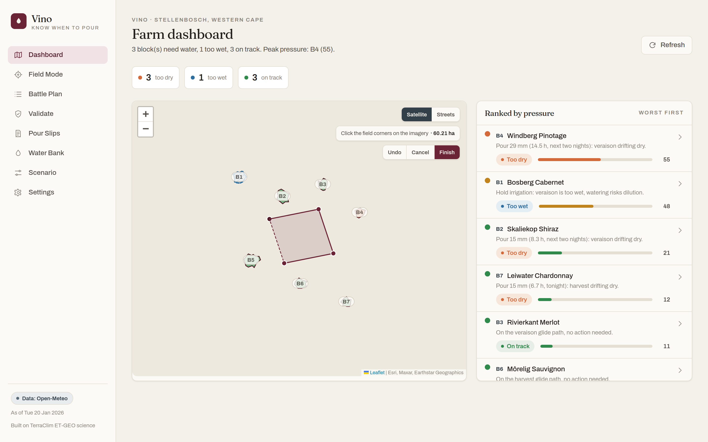
*Tracing a new block by clicking its corners on the map. Vino computes the outline's area live as you draw.*

**Drawing your own block:** the map isn't just a picture. Use the trace tool to click vertices directly onto the satellite image and outline a real field boundary; Vino computes its true area and centroid on the spot and starts scoring it like any other block. This is the same polygon zonal-statistics approach TerraClim's own API uses, so a hand-traced outline gets exactly the same quality of climate data as the farm's original seven blocks.

---

## 2. Block detail: why this block, and what's driving it

Clicking a block slides open its full picture: what growth stage it's in, how far it has drifted from its target, and which weather signal is pushing it there.

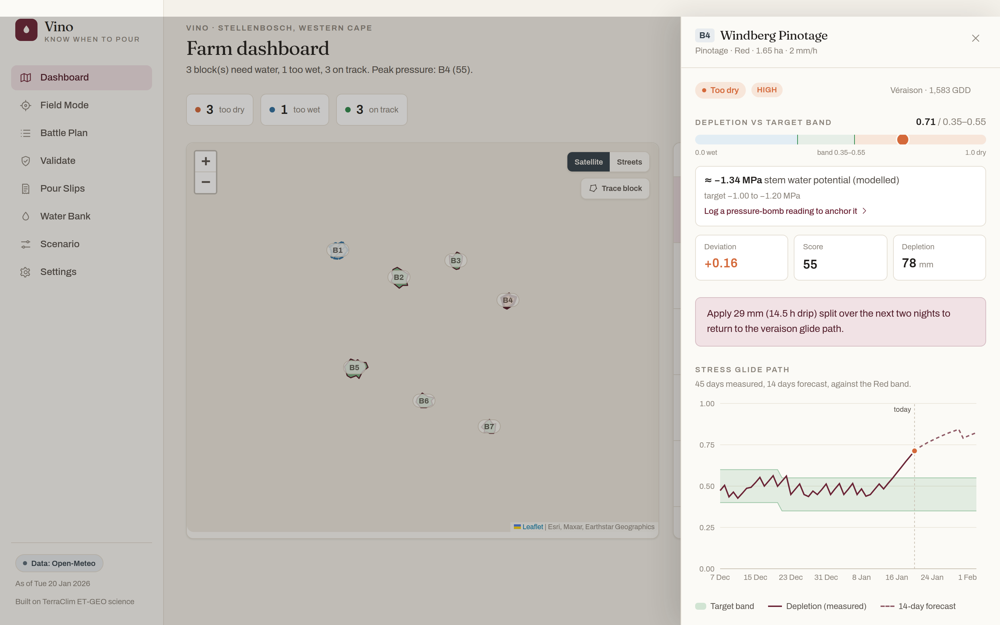
*Windberg Pinotage (B4): veraison, score 55, too dry by 0.16 past the band edge. Modelled stem water potential reads about −1.34 MPa against a −1.00 to −1.20 target.*

**How to read it:** the **score** (0-100) is not "how dry." It's how far the block has drifted from the water band that's actually right for its growth stage and wine style, in *either* direction. A block can score high for being too dry *or* too wet. The stage (budbreak, flowering, fruit set, veraison, harvest) is inferred automatically from accumulated heat, no sensor required. Below the headline numbers, the driver list shows exactly which weather or satellite signal is pushing the score; click any driver's small info icon for a plain-English reason (section 3).

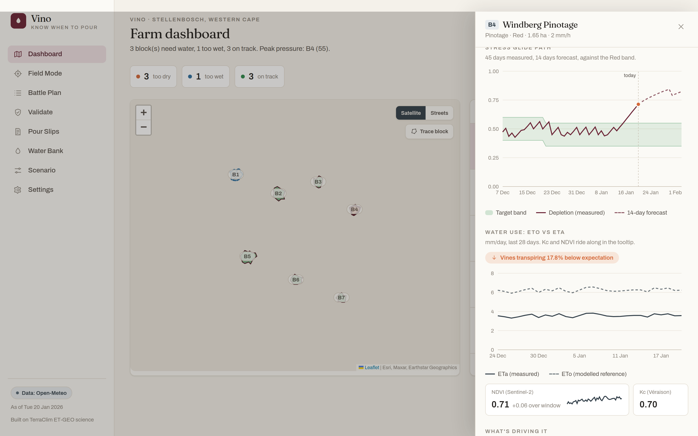
*The same block's glide-path chart, ET panel (ETa vs ETo), Kc and NDVI. "Vines transpiring 17.8% below expectation" is the transpiration-deficit driver.*

The shaded band on the chart is the block's healthy target range for its current growth stage; it moves as the season progresses. The solid line is what actually happened, the dashed line is the forward forecast. When the line drifts out of the shaded band, in either direction, that's what turns the block's status amber, orange or red on the Dashboard.

### The other side of the band: too wet

Open a different block and the same panel can say the opposite thing. This is Bosberg Cabernet, a premium red that's been over-watered recently, and it's the moment nothing else in the room will show you.

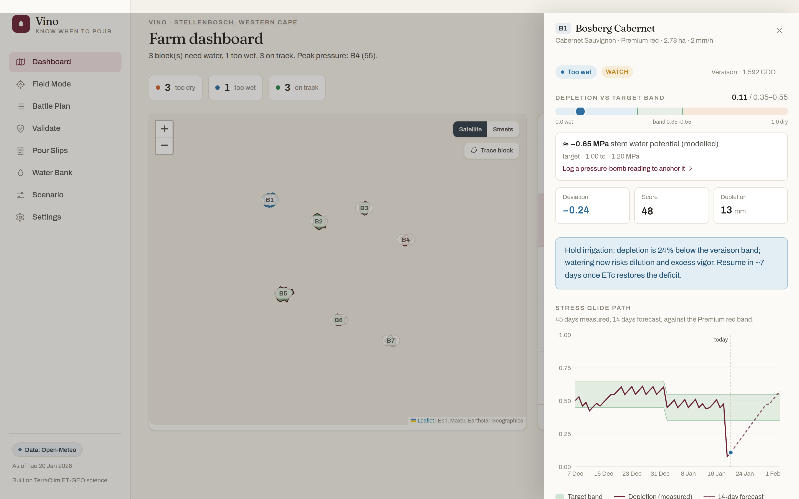
*Bosberg Cabernet (B1): score 48, status too wet, MSWP about −0.65 MPa, wetter than its −1.00 to −1.20 target. "Hold irrigation … risks dilution and excess vigor. Resume in ~7 days."*

Ordinary irrigation tools only ever say "water it." Vino says **stop**, because for wine grapes extra water past this point doesn't help; it dilutes the sugar and colour the vine has already built and pushes leafy growth instead of fruit quality. The Pour Slip for a block like this becomes a **Hold Slip** (section 4).

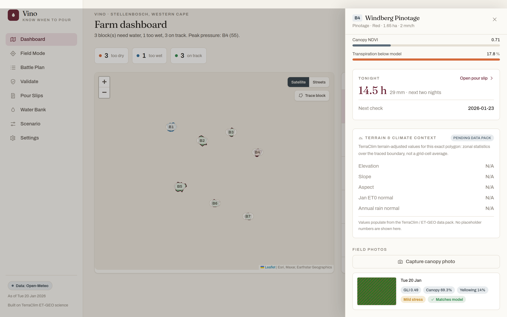
*A canopy photo on file for this block: GLI 0.49, 69% canopy cover, 14% yellowing, flagged "Mild stress" and marked as agreeing with the model.*

**Field photos:** from any block's detail panel (or from Field Mode) you can snap a canopy photo. Vino scores it for greenness, canopy cover and yellowing, then tells you whether the photo agrees with what the water model predicted, a second, independent check that costs nothing but a phone camera.

---

## 3. AI Insights: click anything, get a plain-English answer

Every score, driver, recommendation and technical term in the app has a small explain icon next to it. Click it and a panel slides open with two to four sentences explaining, in grower language, exactly what you're looking at and why it matters.

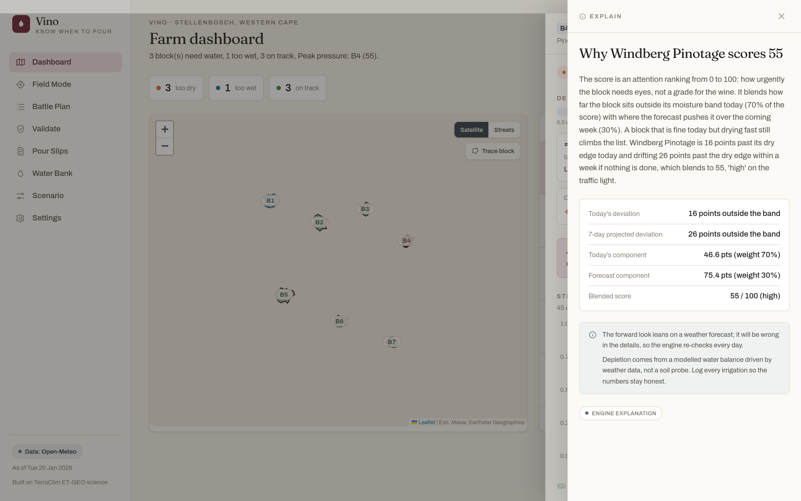
*The Insight panel open on B4's score: a headline, a plain-English paragraph, the facts behind it, honest caveats, and an "Engine explanation" source tag.*

**What makes this trustworthy:** the explanation is **not** generated freely by an AI model. It's assembled from the same numbers already on your screen and rendered from a template, so it can never say something the engine hasn't actually calculated. If you add an AI key in Settings, that layer only rephrases the wording to sound more natural, it's not allowed to introduce a single new number. The small tag at the bottom of the panel always tells you which happened: *Engine explanation* or *AI-phrased*.

---

## 4. Pour & Hold Slips: today's watering order, on paper

This is the one screen meant to leave the office. It turns a block's status into a single instruction a foreman can act on tonight: how many millimetres of water, how many hours of drip, or, just as often, an order to hold off entirely.

| | |
|---|---|
| 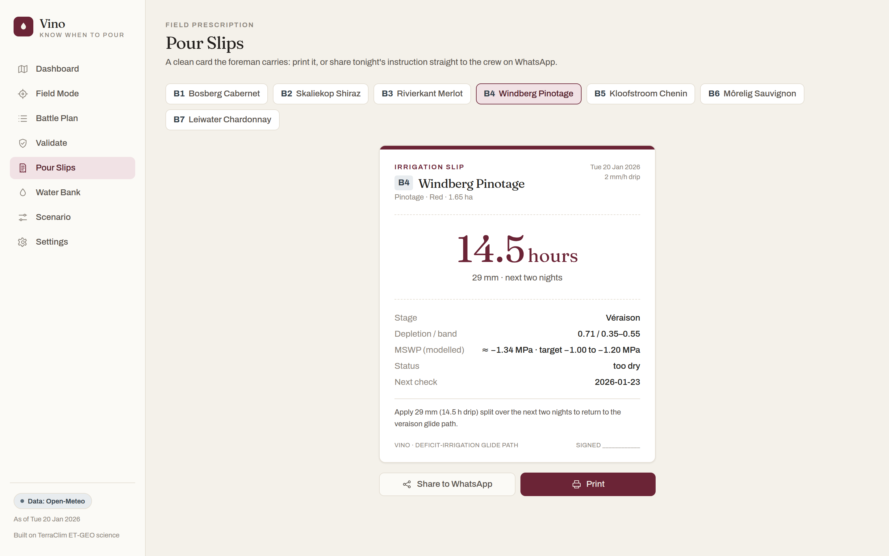 *B4's Pour Slip: 29 mm, 14.5 hours of drip, spread over two nights.* | 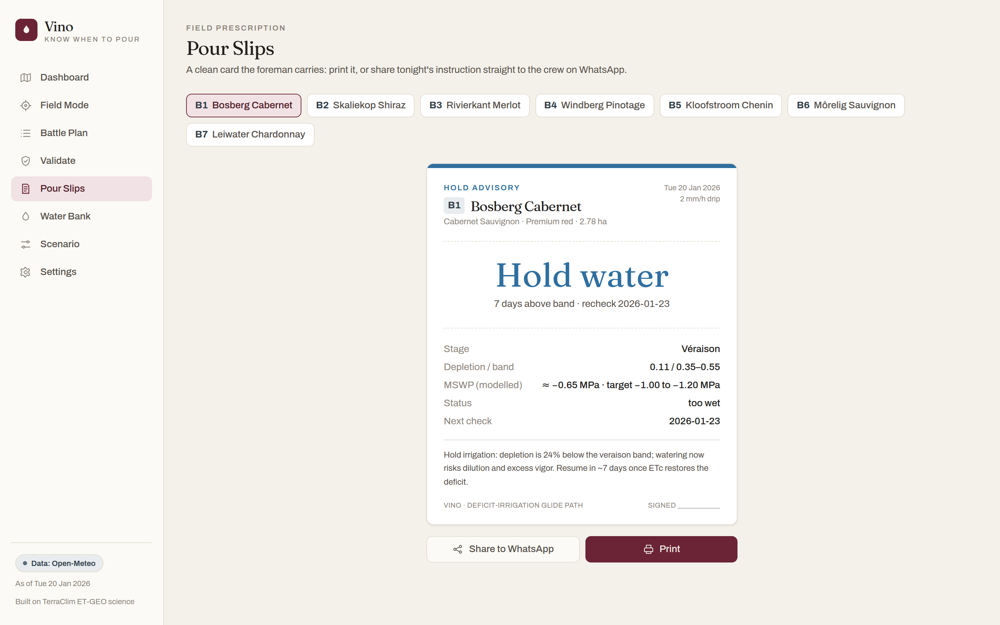 *B1's Hold Slip: no water tonight, recheck in about 7 days.* |

**How to use it:**
1. Pick a block from the list at the top.
2. If it's too dry, you get a **Pour Slip**: exact millimetres needed and the matching drip runtime in hours, calculated from that block's own application rate.
3. If it's too wet, you get a **Hold Slip** instead, a plain instruction not to irrigate, plus roughly how many days until it's safe to water again.
4. Print it, or tap the WhatsApp button to send it straight to whoever is doing the irrigation tonight.

---

## 5. Battle Plan: when you don't have enough water for everyone

Some nights you don't have the pump time, the labour, or the water to irrigate every block that wants it. Tell Vino how many hours you actually have, and it builds a multi-day schedule that spends those hours where they matter most, and skips blocks the sky is about to water for free.

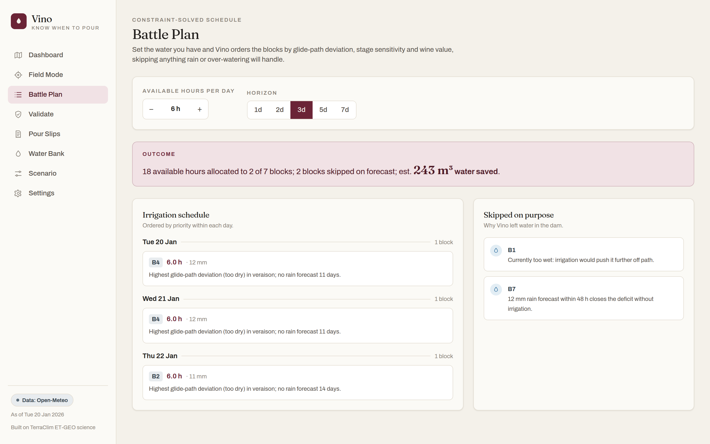
*A 6-hour/day, 3-day Battle Plan: B4 waters first both available nights, then B2; B1 is skipped for being too wet and B7 for 12 mm of rain inside 48 hours. 243 m³ saved.*

**How to use it:**
1. Enter how many hours of irrigation you have available per day, and how many days ahead to plan.
2. Vino ranks every thirsty block by how urgent it is for that block's growth stage and wine style, not just how dry it is.
3. It allocates your hours to the highest-priority blocks first, and explicitly skips any block with meaningful rain forecast in the next two days, or any block that's currently too wet.
4. Read the "skipped" list; it always tells you exactly why a block was left out, so nothing feels arbitrary.

---

## 6. Season Water Bank: will the dam last until harvest?

Zoom out from tonight to the whole season. Enter what's left in the dam and Vino projects demand for every block through to harvest, so you know today whether you're on track or heading for a shortfall, while there's still time to act.

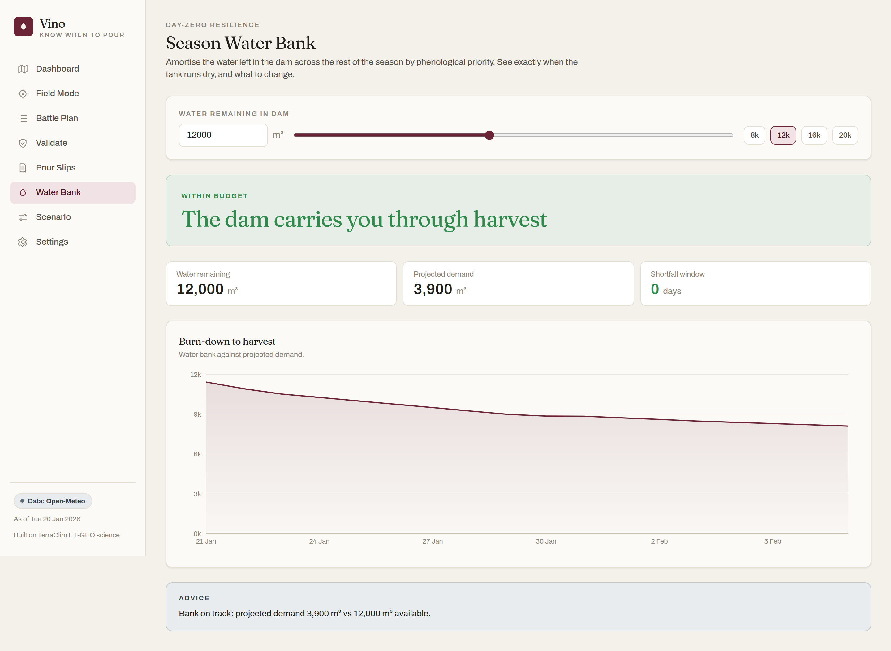
*Season Water Bank on 12,000 m³ remaining: projected demand 3,900 m³ through harvest, verdict "the dam carries you through harvest."*

**How to read it:** enter the water remaining in your dam or allocation, in cubic metres. The burn-down chart projects how that balance depletes over the rest of the season against expected demand across all blocks. If the projection runs dry before harvest, the verdict card tells you the date, and the advice line suggests the cheapest lever to pull, typically tightening the lowest-priority blocks toward the dry edge of their band first.

---

## 7. Scenario: what happens if the weather turns?

Before a heatwave or a dry spell actually arrives, ask Vino to imagine it. Pick a scenario and every block on the farm re-scores itself as if that weather had already happened, so you can see who gets into trouble first.

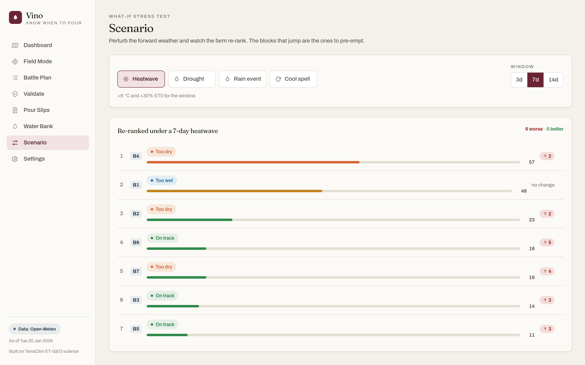
*A 7-day heatwave scenario applied: every block re-scores instantly. B4 climbs from 55 to 57; six blocks read worse, none better.*

**How to use it:** choose a scenario, heatwave, drought, an incoming rain event, or a cool spell, and how many days it runs. Vino recomputes every block's score under that hypothetical and shows the change next to each one, so blocks that would jump into trouble stand out immediately. It's a rehearsal, not a real change: nothing is logged and no water is scheduled, this is purely for planning ahead.

---

## 8. Field Mode: the screen you actually open every morning

Nobody opens a dashboard while standing in a vineyard. Field Mode strips everything down to one number: pick the block you're standing in (or let GPS find it), and get a single, unambiguous instruction.

| | |
|---|---|
| 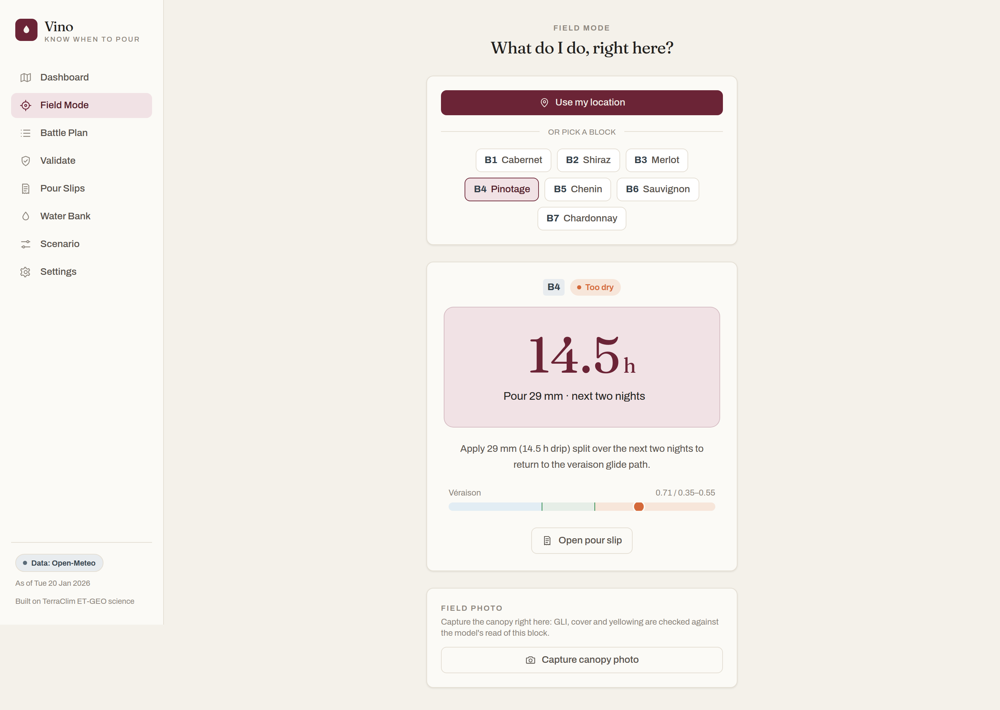 *Field Mode with B4 selected from the block picker: one instruction, 14.5 hours, pour 29 mm.* | 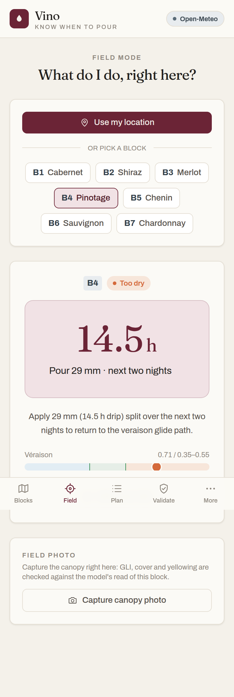 *The same screen at phone size. This is the view meant for the row, not the office.* |

**How to use it:** open Field Mode on your phone. If GPS places you inside one of the traced block outlines, it selects that block automatically; otherwise use the manual picker to choose it yourself, useful at the venue or anywhere GPS can't pin you to a specific row. You'll see one large instruction: a pour time in hours, or a hold notice. From here you can also snap a canopy photo.

---

## 9. Validate: proving the model is actually right

A model is only useful if you can trust it. This screen is where Vino shows its work: comparing its own predictions against pressure-bomb readings you log by hand, canopy photos taken in the field, and a replay of the model against real past weather to see whether it would have caught trouble in advance.

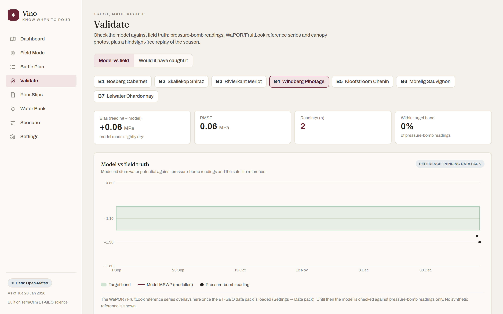
*Model vs field for B4: bias +0.06 MPa, RMSE 0.06 MPa from 2 logged pressure-bomb readings. Reference series marked "pending data pack" until the ET-GEO validation layer is loaded.*

**Three ways to check the model:**
1. **Pressure-bomb readings.** Take one reading in the field with a pressure chamber, log the MPa value here, and Vino shows you the gap between its estimate and your ground truth, then uses it to calibrate.
2. **Canopy photos.** Upload a photo of the vine canopy and Vino scores its greenness and visible stress, then tells you whether that agrees with what the water model predicted.
3. **Backtest.** Replay the model against a past season using only the information that would genuinely have been available on each day, no hindsight, and see how many days of warning it would have given before a real heat event.

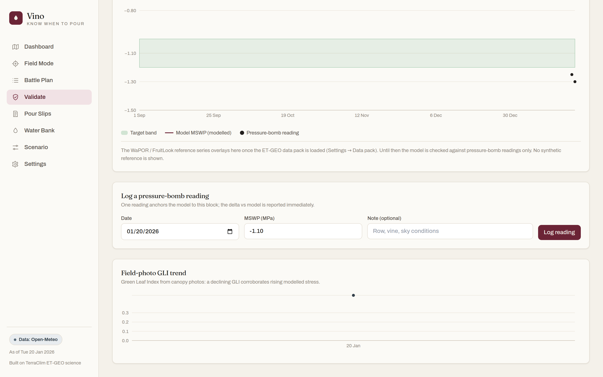
*Logging a pressure-bomb reading, and the field-photo GLI trend building alongside it.*

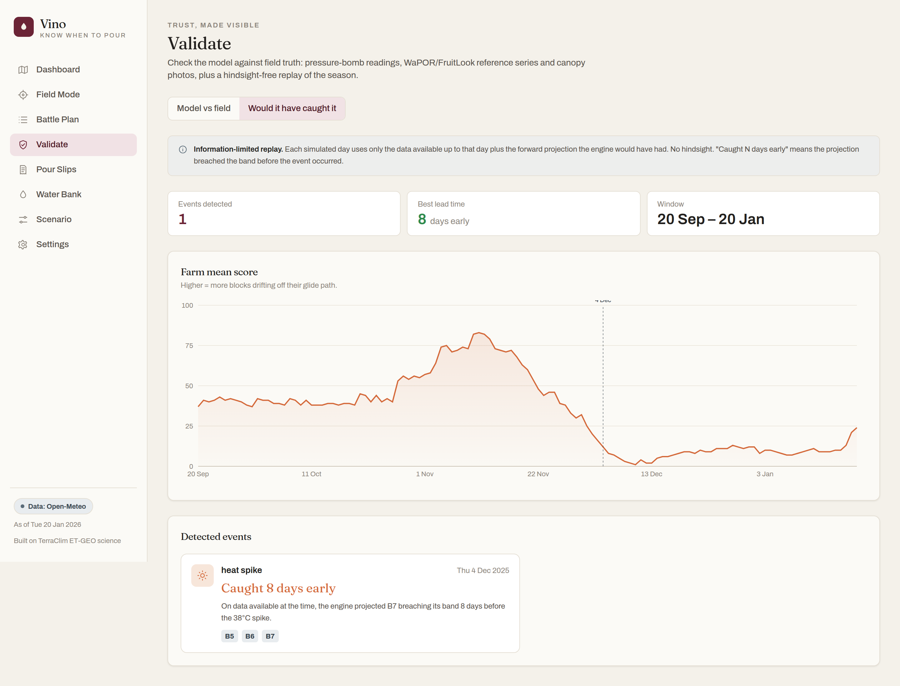
*The information-limited backtest: one heat-spike event detected, an 8-day lead, "caught 8 days early."*

This tab replays a past stretch of the season day by day, and on each simulated day the model only ever sees the weather that would genuinely have been known at the time, never a peek at what happened next. When a real heat spike hit, Vino checks how many days beforehand its own forward projection had already started climbing toward the edge of the band: honest advance warning, not hindsight dressed up as prediction.

---

## 10. Settings: choosing where the climate data comes from

Vino never hard-codes a data source. Every number in the app, from the map colours to the pour slips, ultimately comes from whichever provider is active here, and you can switch between them live, without restarting anything.

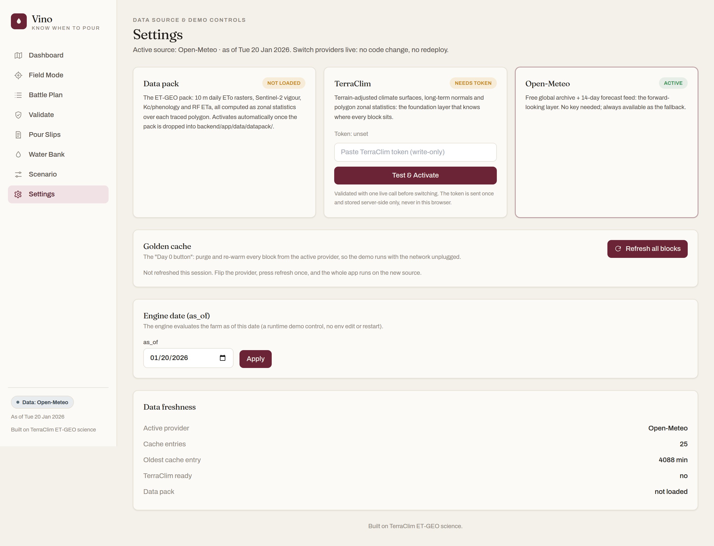
*Settings: Open-Meteo active, the ET-GEO data pack and TerraClim API cards waiting for Day 0, cache controls and the engine date below.*

**The three sources, and when to use each:**
1. **ET-GEO data pack**, the real 10 m satellite and station data. Point Vino at the data pack folder and it becomes the primary source automatically.
2. **Live API token.** Paste a token here, press Activate, and Vino validates it live before switching over; the badge in the header updates immediately.
3. **Free fallback**, used automatically whenever neither of the above is configured, so the app always has real, current weather to work with.

---

## 11. Reading the colors and the numbers

The same five colours mean the same thing everywhere in the app: on the map, in lists, on charts. Once these are familiar, you can read the whole farm's state from the Dashboard alone.

| Status | Score range | Colour |
|---|---|---|
| Stable | 0-25 | Green |
| Watch | 26-50 | Amber |
| High | 51-75 | Orange |
| Critical | 76-100 | Red |
| Too wet | any score | Blue hatch |

| Term | What it means |
|---|---|
| **Score** | 0-100. Distance from the healthy target band, blended from today's reading (70%) and the 7-day forecast (30%). High is bad, whether the cause is too dry or too wet. |
| **ETo** | Reference evapotranspiration: how much water the local weather alone would pull from a well-watered surface. The base "thirst" of the day. |
| **ETa** | Actual evapotranspiration: what the vines are really drinking, measured. When it runs below ETo × Kc, the vines are already throttling back. |
| **Kc** | Crop coefficient. A multiplier on ETo, specific to the vine's growth stage, that converts generic weather thirst into vineyard-specific water use. |
| **NDVI** | A satellite greenness score for the canopy: 0 is bare soil, roughly 0.9 is dense healthy leaf. |
| **MSWP** | Midday stem water potential, in MPa. The number a pressure bomb gives a viticulturist directly; Vino estimates the same scale from its water model. |
| **Glide path** | The target depletion band for a block's current growth stage and wine style. The whole app is built around staying inside it, not around always being "full." |

---

## 12. Running it yourself

Everything above runs from two small local services. One command starts both.

```bash
make dev
```

This installs anything missing and starts the backend on port 8000 and the frontend on port 5173. Open `http://localhost:5173`. With no configuration at all, the app runs on realistic demo data, so there's always something on screen.

| Folder | What's in it |
|---|---|
| `backend/` | The engine: growth-stage tracking, the water balance, scoring, the battle plan, season bank, backtest and AI Insights. Python, FastAPI. |
| `frontend/` | Every screen in this guide. React, with a typed client that falls back to realistic mock data automatically if the backend isn't running. |
| `docs/` | The hackathon brief, the full API contract, the pitch and demo script, and the research behind every constant the engine uses. |

```bash
make test    # backend test suite
make build   # production frontend build (the same build the live site deploys)
```

---

*Vino, ET-GEO Hackathon 2026, Marshall Dube & Obey Musimbo. This guide was generated from the running app; every number shown is a real value the engine produced, not an illustration.*
